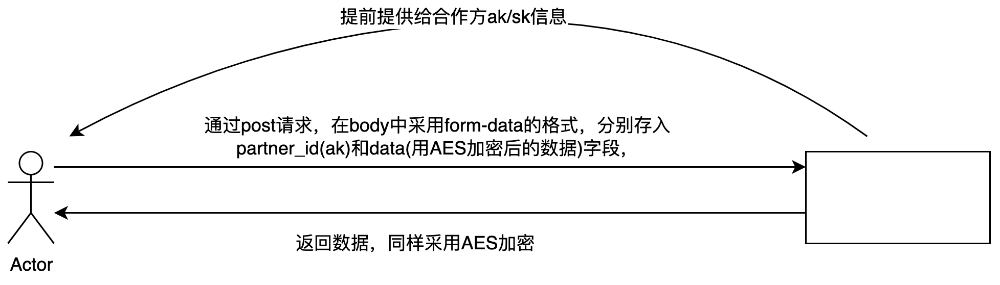

### 什么是AK/SK

ak/sk是一种身份认证方式，常用于系统间接口调用时的身份验证，其中ak为Access Key ID，sk为Secret Access Key。客户端和服务端两者会协商保存一份相同的sk，其中sk必须保密。

### AK/SK认证的流程

假设我们目前有这么个情景：我们（开发人员）需要向合作方提供一个接口，然后我们需要保证这个接口返回的数据是加密的，避免被人拦截。

首先，我们提供给合作方ak-作为身份标识，sk-作为对请求数据的加密密钥。然后合作方在调用我们的接口的时候，传入ak作为身份标识，然后将其他的参数，用sk加密，这里我们以`AES对称加密`举例,然后我们收到他们的请求后，拿到ak，去数据库里查询对应的合作方信息，如果没有则说明身份不对，如果查询到里信息，则认证通过，然后拿到对应的sk去对加密内容进行解密、处理业务流程、返回数据（同样采用刚刚的sk进行加密）。

