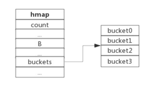
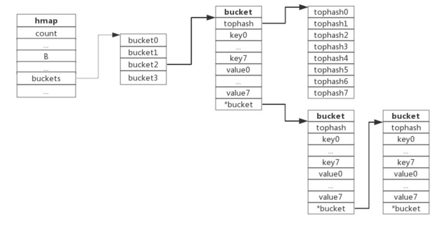

&emsp;&emsp;&emsp;这是一篇关于golang面试题的文章，主要是记录本人在面试过程中常见的一些题目以及自己认为可能会考察的面试题。当然里面的内容也是用我自己的话术来总结的，可能存在不严谨的地方，还望指出！！！
## 数据结构
&emsp;&emsp;&emsp;面试题中常出现的数据结构 `Slice、Map、Channel` 这三个。

### Slice

```go
type Slice struct{
    array   unsafe.Pointer
    len     int
    cap     int
}
```
从数据结构上看slice很清晰，array指针指向底层数组，len表示切片长度，cap表示切片容量。
* slice扩容
  使用append向slice追加元素的时候，如果slice空间不足，则会出发扩容。扩容实际上是重新分配一块更大的内存，将原slice的数据拷贝到新的slice，然后返回新的slice，扩容后再把数据追加进去。
* 扩容原则
  如果原slice的容量小于1024，则将slice的容量扩大为原来的2倍
  如果原slice的容量大于1024，则将slice的容量扩大为原来的1.25倍。
* 扩容的思考
  当切片比较小时，采用较大的扩容倍速，可以避免频繁的扩容，从而减少内存分配的次数和数据拷贝的代价。
  当切片比较大时，采用较小的扩容倍速，主要是为了避免浪费空间。
### Map
```go
type Map struct {
    count 		int //当前保存的元素个数
    B 			uint8 //bucket数组的大小
    buckets 	unsafe.Pointer //bucket数组，数组的长度为2^B
    oldBuckets 	unsafe.Pointer //老旧的bucket数组，用于扩容
    ...
}
```
下图展示了一个拥有4个bucket的map

在本例子中，hmap.bucket数组的长度是4(2^B)。元素经过Hash运算后将落到某个bucket中进行存储。
```go
type bmap struct {
    //每个bucket可以存储8个键值对
    tophash 	[8]uint8 //存储Hash值的高8位
    data 		[]byte	//key value数据：key/key/key/key/....value/value/value/value/...
    overflow 	*bmap //溢出bucket的地址
}
```
tophash是一个长度为8的整型数组，Hash值相同的键(准确地说是Hash值的低位相同键)存入当前bucket时会将Hash值的高位存储在该数组中，以便后续匹配。
data区存放的是key-value数据，存放顺序是key/key/key/....value/value/value/，这样存放是为了节省字节对齐带来的空间浪费。
overflow指针指向的是下一个bucket，在此将所有冲突的键连接起来。

* Hash冲突
go采用链地址法来解决冲突，由于每个bucket可以存放8个key-value，所以同一个bucket存放超过8个key-value时就会再创建一个bucket，用类似于链地址法的方式将bucket连接起来。
* 负载因子
`负载因子 = 键数量 / bucket数量`
负载因子过小，说明空间利用率低；
负载因子过大，说明冲入严重，存取效率低。
当负载因子达到6.5的时候才会出发rehash
* 扩容
1）扩容条件
负载因子达到6.5的时候，即平均每个bucket存储的键值对达到6.5个以上；
overflow的数量达到2^min(15,B)
2）增量扩容
当负载因子过大时，就新建一个bucket数组，新的bucket数组是原来的2倍。然后旧bucket数组中的数据搬移到新的bucket数组中去。它的扩容是采用rehash，渐进式扩容。即每次访问map的时候都会出发一次搬迁，每次搬迁2个键值对。
扩容细节：显示让hmap数据结构中的oldbuckets成员指向原buckets，然后申请新的buckets数组（长度为原来的2倍），并将数组指针保存到hmap数据结构中的buckets成员中，这样就完成了新老交替，后续的迁移工作是将是从oldbuckets数组中逐步迁移键值对到新的buckets数组中。待oldbuckets数组中所有键值对搬迁完毕后，就可以释放oldbuckets数组了。
3）等量扩容
所谓的等量扩容，并不是扩大容量，而是bucket数量不变，重新做一遍类似增量扩容的迁移动作，把松散的键值对重新排列一次，以使bucket的使用率更高，进而保证更快的存取速度。
在极端情况下，比如经过大量的元素增删后，键值对刚好集中在一小部分bucket中，这样就会造成溢出的bucket数量增多。
4）查找过程
a.根据key值计算hash值
b.取hash值的低位与hmap.B取模来确定bucket的位置。
c.取hash值高位，在tophash数组中查询。
d.如果tophash[i]中存储的hash值与当前key的hash值相同，则获取tophash[i]的key值进行比较。
e.当前bucket没有找到，则依次从溢出的bucket中查找。
### Channel
```go
type Map struct {
    qcount 		uint // 当前环形队列中剩余的元素个数
    dataqsiz 	uint // 环形队列的长度，即可以存放的元素个数
    buf 		unsafe.Pointer //环形队列指针
    elemesize 	uint16 //每个元素的大小
    closed 		uint32 // 标识关闭状态
    elemtype 	*_type //元素类型
    sendx 		uint // 写队列下标，指示元素写入时存放到队列中的位置。
    recvx 		uint // 读队列下标，指示下一个被读取的元素在队列中的位置
    recvq 		waitq // 等待读消息的协程队列
    sendq 		waitq // 等待写消息的协程队列
    lock 		sync.Mutex // 互斥锁，chan不允许并发读写
}
```
channel的底层是实现了一个环形队列作为缓冲区，datasize记录buf的长度，count记录buf的剩余长度，buf是buf数组的指针，sendx/recvx表示队尾和队头，按照这个位置写入和读取，还有sendq和recvq分别是存放读和写的队列。
* 向管道写数据
如果缓冲区中有空余位置，则将数据写入缓冲区，结束发送过程
如果缓冲区中没有空余位置，则将当前协程加入sendq队列，进入睡眠并等待被协程唤醒。
* 从管道读数据
如果缓冲区中有数据，则从缓冲区中取出数据，结束读取过程。
如果缓冲区中没有数据，则将当前协程加入recvq队列，进入睡眠并等待被写协程唤醒。
* 从管道中读数据，会阻塞的情况
a.管道没有缓冲区 
b.管道有缓冲区，但缓冲区中没有数据
c.管道的值为nil
* 往管道中写数据，会阻塞的情况
a.管道没有缓冲区
b.有缓冲区，但缓冲区已满
c.管道的值为nil
`往关闭的管道中写入数据会panic，但可读`

### 数据结构相关问题
1) 有哪些类型不是并发安全的
数组、切片、字典、通道、接口都不是并发安全的。
struct 或底层是 struct 的类型并发赋值大部分情况并发不安全，这些类型有：复数、字符串、 数组、切片、字典、通道、接口。因为struct赋值的时候，不是原子操作，各个字段的赋值都是独立的，所以在并发操作的情况下可能会出现异常。解决：我们可以使用 atomic.Value 来保证赋值的并发安全。
```go
    var v atomic.Value
    v.Store(Test{1,2})
    v.Load().(Test)
```
字节型、布尔型、整型、浮点型、字符型（安全）
文章：https://cloud.tencent.com/developer/article/1810536
2) 空结构体的作用
首先空结构体不占用内存空间，所以可以用作于占位符，比如我们用map去实现set，那我们就可以将value赋值一个空结构体
3) 为什么channel是并发安全的
因为channel底层在出队，入队的时候也加了锁
4) chamnel 有缓冲和无缓冲的区别
无缓冲是同步的，例如 make(chan int) ，就是一个送信人去你家门口送信，你不在家他不走，你一定要接下信，他才会走，无缓冲保证信能到你手上。 有缓冲是异步的，例如 make(chan int, 1) ，就是一个送信人去你家仍到你家的信箱，转身就走，除非你的信箱满了，他必须等信箱空下来，有缓冲的保证信能进你家的邮箱。
5) init执行顺序？
在同一个go文件里，按照定义的顺序执行，在不同文件里的话，按照文件的名称顺序执行
6) channel和mutex如何选择
分情况选择吧 .首先channel的核心是数据流动，把数据分发给别的协程，而锁则是专注于不流动的数据，某段时间只给一个协程访问数据的权限
7) golang的mutex和channel谁的性能更高
性能的话 肯定是mutex的更高些的 因为Channel 会使得当前的 Goroutine 让出 cpu 给另一个 Goroutine 获得执行机会，这个上下文的切换周期不低，至少远高于 Mutex 检查竞争状态的成本(后者通常只是一个原子操作)
8) make和new的区别
9) map如何有序
定义一个结构体，key value的结构体 然后可以通过sort包 去实现sort接口，然后就可以做到这个效果了

## 内存管理


## 并发控制
并发
## error处理