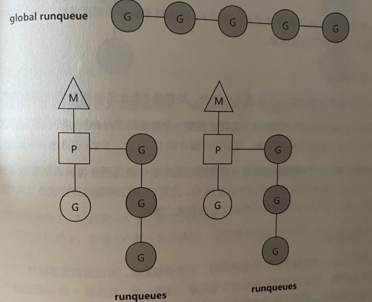
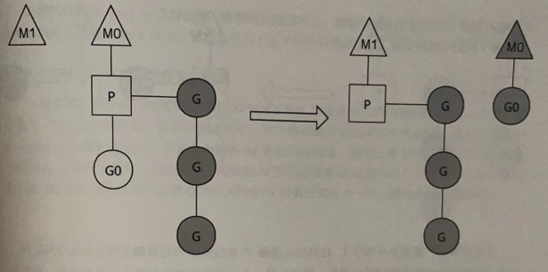

&emsp;&emsp;&emsp;这是一篇关于golang面试题的文章，主要是记录本人在面试过程中常见的一些题目以及自己认为可能会考察的面试题。当然里面的内容也是用我自己的话术来总结的，可能存在不严谨的地方，还望指出！！！
## 协程
1) 进程、线程、协程
   进程是应用程序的启动实例，每个进程都有独立的内存空间，不同进程通过进程间通信方式来通信
   线程是从属于进程，每个进程至少包含1个线程，线程是cpu调度的基本单位，多个线程之间可以共享进程的资源并通过共享内存等线程间通信的方式来通信
   协程是可以理解为轻量级的线程，与线程相比，协程不受操作系统调度，协程调度器是由应用程序提供，协程调度器按照调度策略把协程调度到线程中运行。
2) GMP模型
   G-协程 M-工作线程 P-处理器
   M必须持有P才可以进行调度，P的个数默认和cpu个数一样，可以通过setGoMaxProcs()指定P的个数，同时每个M都有一个G0进行协程调度。
   
   上图中包括两个工作线程M，每个M持有一个处理器P，并且每个M中有一个协程G在运行。灰色背景的协程正在等待被调度，他们位于被称为runqueues的队列中。每个处理器P中又有一个本地runqueue队列，此外还有一个全局的runqueue队列，由多个处理器共享。
3) 调度策略
* 队列轮转
  每个P都维护着一个本地的runqueue，P依次调用G并执行
* 系统调用
  
  如上图所示，当GO即将进人系统调用时，MO将释放P，进而某个冗余的M1获取P，继续执行P队列中剩下的G。MO由于陷人系统调用而被阻塞，M1接MO的工作，只要P不空闲，就可以保证充分地利用CPU。执行完系统调用之后，会看M能不能获取到P,对G0进行不同对处理
  a.如果有空闲P，则获取一个P，继续执行G0
  b.如果没有空闲P,则将G0放入全局队列，等待被其他的P调度
* 工作量偷取
  当P中没有协程需要调度，会看全局队列中是否有G待执行，没有的话，从其他P的队列中拿一半的G去执行
* 抢占式调度
  调度器会监控每个协程的执行时间，一但执行时间过长且有其他但协程在等待执行时，会把协程暂停，转而调度等待的协程，以达到类似于时间片轮转的效果。
  学习连接：https://learnku.com/articles/41728