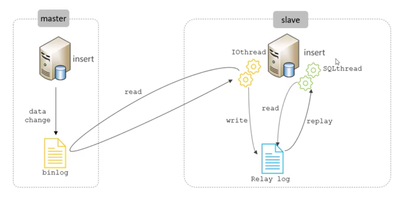

**瞎扯时间到！！！**

### 什么是主从复制？

主从复制是指将主库到表结构、表数据也就是DDL和DML操作通过**binlog**日志传输到从库中去，然后在从库中对这些日志从新执行(重做),从而使的从库和主库数据保持同步。

mysql支持一台主库向多台从库进行复制，从库也可以作为主库像其他的从库同步数据，形成链式复制。

### 为什么需要主从复制
1. 主库出现问题，可以快速切换到从库，提供服务
2. 实现读写分离，降低主库的访问压力。写操作全都在主库上执行，读操作都在从库上执行
3. 可以在从库进行备份操作，以避免备份期间影响主库服务（备份期间会加一个全局锁，整个数据库就会是只读的，无法进行增删改操作。会把整个库锁住）

### 原理
1. master主库在事务提交的时候，会把数据变更记录在二进制日志文件binlog中
2. 从库有个IOThread线程读取主库的二进制日志文件binlog，写入到从库的中继日志RelayLog里。
3. slave重做中继日志RelayLog中的事件，将改变反映在自己的数据中

