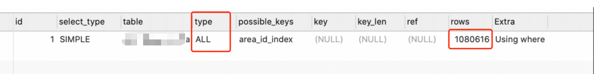

# 一、背景
一个接口执行的业务逻辑是返回区区域范围内所有停车场的热度值用于热力图渲染，发现这个接口响应时间普通在2.4s左右，影响前端热力图加载速度

# 二、业务逻辑

这个接口中共有3个数据查询操作<br>
1. 获取区域信息：获取城市下各街道区域信息，全表数据量级19条， 本业务涉及10条,因数据量比较少，所以忽略此sql查询对耗时影响
```sql
SELECT * FROM `table1` WHERE `parent_area_id` = "id" AND `project_id` = 31 AND is_deleted=0
```
2. 获取区域下所有停⻋场数据，全表数据量级1155657条，本业务涉及1293条
```sql
SELECT * FROM table2 WHERE (open_tag=0 AND area_id IN ("area1","area2","area3",
"area4","area5","area6","area7","area8","area9","area10","area11"))
```
explain 分析

3. 获取挖掘热⼒值数据，全表数据量级35238条，本业务涉及1293条
```sql
SELECT `uid`,avg(`val`) as avgVal, ctime FROM `table3` WHERE
project_id=31 AND date>=20230414 AND date<=20230421 AND is_deleted=0 GROUP BY`uid`
```

经过上⾯explain结果及ral⽇志初步分析是获取区域下全量停⻋场数据会⽐较慢，因为在查询 区域范围内停车场table2 表时扫描了全表<br>
但查询的where条件⾥area_id是索引字段,使⽤where in查询为什么不会命中索引查询<br>
经过查询[资料查询](https://www.cnblogs.com/bulushengse/p/12703789.html)**结论是当in太多时，可能会使索引失效**
# 三、优化思路
1. sql逻辑优化
实践过程中，发现强制使⽤area_id索引，扫描⾏数并没有得到改善，扫描了380116⾏

结合业务场景，这个停⻋场列表获取场景为⼤数据平台城市级的数据检索，可以考虑给city_id加个索引，查询时，将项⽬对应的城市作为where条件，这样的话，可以命中city_id索引，这样的话，可以⼤⼤减少扫描⾏数
```sql
SELECT * FROM table2 WHERE (city_id=1 and open_tag=0 AND area_id IN ("area1","area2","area3",
"area4","area5","area6","area7","area8","area9","area10","area11"))
```

2. 业务逻辑上优化
既然area_id使⽤in的查询⽅式会有索引失效的情况，那可不可以将每个area_id分别查询，然后合并结果？<br>
业务分析：城市级下属区域（街道）⼀般都是⽐较少的⼀般在10个左右，并发量是可控范围内；这样的话，以area_id=xxxx为条件，分别并发请求，扫描⾏数更少；就可以命中area_id索引了,⽽且也不需要加city_id索引；

# 四、总结
1. 以上两种⽅法对⽐结果：使⽤sql优化⽅案接⼝平均耗时在180ms，使⽤业务逻辑优化⽅案接⼝平均耗时在200ms；sql⽅案会稍等快⼀些
2. 如果遇到接⼝访问慢的情况，⼤概率是mysql查询耗时太⻓，需要分析sql的执⾏效率，观察扫描⾏数和索引命中情况，尽可能的去优化sql来解决接⼝耗时问题
3. 上⾯的case之所以通过修改业务逻辑实现，是因为这个⽅法在其它业务中也有调⽤，添加city_id参数对上游影响⽐较⼤，所以直接优化了业务⽅法本身