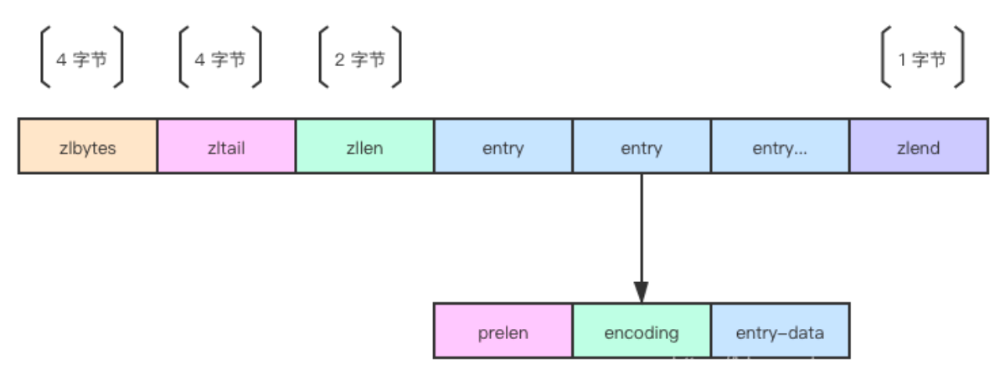

&emsp;&emsp;&emsp;这是一篇关于redis面试题的文章，主要是记录本人在面试过程中常见的一些题目以及自己认为可能会考察的面试题。当然里面的内容也是用我自己的话术来总结的，可能存在不严谨的地方，还望指出！！！
## 基础数据类型以及对应的底层实现
**string「key-value」结构**
string是一个比较通用的数据结构，可以存储json，字符串、数字等等，我们使用它来存储一些统计信息啊、计数啊或者一些静态资源等。
**hash 「key-field-value」结构**
我们一般将有多个属性的结构使用 Hash 类型进行存储，比如有 id，用户名，性别等属性的用户信息
**list 「key-value-value。。。」结构**
我们可以利用list来实现列表相关的内容，比如我们将某地区的48小时的停车难度存入list中。
**set 「key-value-value。。。」**
我们可以用 Set 来实现标签功能，比如记录一个文章的标签我们使用 Set 类型，向该集合内添加标签 id，之后获取该集合所有成员即可取出该文章关联的所有标签。
**zset sortedset 「key-score-value-score-value。。。」**
zset 最典型的一个应用是排行榜，比如我们使用 Zset 做一个视频点赞排行榜，score 负责存储点赞数，member 为视频 id.

基本数据结构
**_SDS_**
为什么要有sds？
1.redis是c实现的，然后c如果要存储字符串的话是存储char数组或者char指针，如果想要获取字符串的长度，就要遍历字符串，找到他的结束符，效率很低，不适合 Redis 这样用于高并发场景的数据库。同时这样的字符串也不适合动态扩展，因为没有记录它被分配的内存是多少。此外，不记录长度和分配内存空间的话，扩展字符串也容易造成缓冲区溢出。而 SDS 通过空间预分配和惰性空间释放策略减少了修改字符串带来的内存重分配次数。
2.SDS 还是二进制安全的。二进制安全指的是 SDS API 都是以处理二进制的方式来处理字符串内容的，程序不会对其中的数据做任何限制、过滤、或者假设，数据在写入时是什么样的，它被读取时就是什么样。
SDS底层结构：
```cgo
struct __attribute__ ((__packed__)) sdshdr32 {
    uint32_t len; /* 已使用的长度 */
    uint32_t alloc; /* buf 分配内存空间，不包含空终止符号(\0) */
    unsigned char flags; /* 标志位，3位最低有效位表示类型, 其余5个比特位未被使用 */
    char buf[];
};
```

SDS 预分配空间和惰性释放空闲空间策略
预分配空间策略： sds预分配空间 指的是在buf数组后面分配一些未使用的空间大小，当后面字符串内容变长的时候可以减少内存分配。预分配空间策略为：新增长度 < 1MB ，则按新长度的两倍分配；新增后长度>= 1MB ，则按新长度 + 1MB 进行分配。
惰性释放空间空闲策略：惰性释放空闲空间这里指的是释放 buf[] 尾部空闲空间。它会在 Redis 的一些 SDS 类型缓冲区空闲过久或过多时触发，也可以由客户端触发，当 SDS 的 API 需要缩短 SDS 保存的字符串时，程序并不立即使用内存重分配来回收缩短后多出来的字节，而是使用 free 属性将这些字节的数量记录起来，并等待将来使用。
**_ZipList_**
结构如下：分别是总字节数、尾节点偏移量、元素数量、对应的元素以及结束标识符。元素的结构为：prelen 记录上一个元素的长度、编码方式和数据

连锁更新问题：由于 ziplist entry 记录的是上一个 entry 的长度，所以会触发连锁更新。 当 ziplist entry 上一个节点大小 < 254 字节时用 1 字节记录长度， >= 254 时用 5 字节记录长度。那么如果出现一种极端情况，连续好多个 entry 大小都为 253 字节，那么前面第一个 entry 因为修改超过了254 字节时，prelen 也会扩大成 5 字节，随后后面的 entry 也会因为前面的大小超过 254 字节而扩大自己的 prelen，这就是“连锁更新”。
**_Listpack_**
结构如下：分别是总字节数、元素数量、对应元素以及结束标示。元素的结构为当前元素的编码、数据以及长度

如何解决连锁更新问题： listpack 因为只记录自己的长度，所以更新不会影响其它节点，也就解决了“连锁更新”问题。
**_Intset_**
```cgo
typedef struct intset {
    /* 编码, 记录整数集合底层数组(contents)的类型*/
    uint32_t encoding;
    /* 记录整数集合包含的元素个数 */
    uint32_t length;
    /* 整数集合的底层实现, 虽声明为 int8_t 类型,但真正的类型取决于 encoding */
    int8_t contents[];
} intset;
```
很简单，整数集合结构体只有三个成员：编码，长度，数据。它的特点是可以减少不必要的内存分配和快速查找元素是否存在，缺点在于插入和删除性能较差。
如何减少不必要的内存分配： 整数集合根据所存储的元素最大值确定编码，编码有三种：INTSET_ENC_INT16，INTSET_ENC_INT32，INTSET_ENC_INT64，它们分别对应 16 位，32 位，64 位整数，根据最大元素所占用空间来分配每个元素所占用的空间。比如当最大的元素只是 16 位范围内的整数时，那么整数集合为每个元素分配 2B 的空间来进行保存即可。同时在判断整数是否存在时，若要查询的整数大于编码范围还可以快速判断元素不存在。
如何快速查找元素是否存在： 整数集合所保存的数据是有序的（从小到大），所以内部可以使用二分查找提升查询速度。
插入和删除性能较差： 插入元素时若该元素大于编码支持的最大值，则需要进行升级，选择一个可以容纳新元素的最小编码。升级时需要进行内存重分配并调整每个元素的偏移量，不过无论升不升级，插入和删除时都涉及 content 数组的内存分配（增加和减少），Redis 并没有为整数集合做预分配内存，原因应该是整数集合是元素数量较少时使用的内部编码，所以尽量节省内存空间。另外，为了保证有序，所以插入和删除时若操作的元素在中间，还需要调整之后元素的位置。所以插入和删除的**最差时间复杂度为 O(n)。
**_Dict_**
```cgo
struct dict {
    dictType *type; /* 字典类型，8 bytes */
    dictEntry **ht_table[2]; /* 哈希表数组 */
    unsigned long ht_used[2]; /* 哈希表拥有键值对数量 */
    long rehashidx; /* rehash 进度/下标 */
    /* 将小尺寸的变量置于结构体的尾部, 减少对齐产生的额外空间开销. */
    int16_t pauserehash; /* rehash 是否暂停， > 0 表示暂停 */
    signed char ht_size_exp[2]; /* 哈希表大小的指数表示，即哈希表大小 = 2 ** exp */
};
```
dict数组其实维护了两个哈希表，平时使用的是下标为 0 的哈希表，当触发扩容或缩容而进行 rehash（重哈希）时，会将下标为 0 的哈希表作为旧哈希表，下标为 1 的哈希表作为新哈希表。旧哈希表的键值对会逐渐迁移至新哈希表，当旧哈希表的键值对数量为 0 时则说明迁移结束，此时将下标为 0 的哈希表释放，并把新哈希表变为下标 0。
接下来我们继续看 dictEntry 结构体：
```cgo
typedef struct dictht {
    dictEntry **table; // 8 bytes
    unsigned long size; // 8 bytes
    unsigned long sizemask; // 8 bytes
    unsigned long used; // 8 bytes
} dictht;
```
由一个哈希表数组，哈希表数组大小的long值，一个用于计算索引的哈希表大小掩码以及已使用的节点数构成，这个哈希表数组，存放的是哈希节点dicEntry，我们会将key-value键值对给它放进去。
```cgo
typedef struct dictEntry {
    void *key;  //存放key值
    union {
        void *val;    //存放value值
        uint64_t u64;    //uint64_t整数
        int64_t s64;    //int64_t整数
    }v;
    struct dictEntry *next;    //指向下个哈希表节点，形成链表
}dictEntry;
```
扩缩容：当哈希表保存当键值对太多或者太少就要通过rehash进行相应当扩容或者收缩。
触发时机：
`# 负载因子 = 哈希表已保存节点数量 / 哈希表大小
load_factor = ht[0].used / ht[0].size`
a.服务器目前没有在执行 BGSAVE 命令或者 BGREWRITEAOF 命令， 并且哈希表的负载因子大于等于 1 ；
b.服务器目前正在执行 BGSAVE 命令或者 BGREWRITEAOF 命令， 并且哈希表的负载因子大于等于 5 ；
如何扩容：
* 为 ht[1] 分配空间， 让字典同时持有 ht[0] 和 ht[1] 两个哈希表。
* 在字典中维持一个索引计数器变量 rehashidx ， 并将它的值设置为 0 ， 表示 rehash 工作正式开始。
* 在 rehash 进行期间， 每次对字典执行添加、删除、查找或者更新操作时， 程序除了执行指定的操作以外， 还会顺带将 ht[0] 哈希表在 rehashidx 索引上的所有键值对 rehash 到 ht[1] ， 当 rehash 工作完成之后， 程序将 rehashidx 属性的值增1。
* 随着字典操作的不断执行， 最终在某个时间点上， ht[0] 的所有键值对都会被 rehash 至 ht[1] ， 这时程序将 rehashidx 属性的值设为 -1 ， 表示 rehash 操作已完成。
rehash的过程中有数据变化怎么办？
关于字典的操作无非就是四个，增删改查。
增加：直接将key-value对增加到h[1]中，即新的哈希表中
删除：先删除h[0]，再删除h[1]，保证都删掉
修改：直接修改h[1]
查找：先在h[0]中查找，查询不到再到h[1]中
