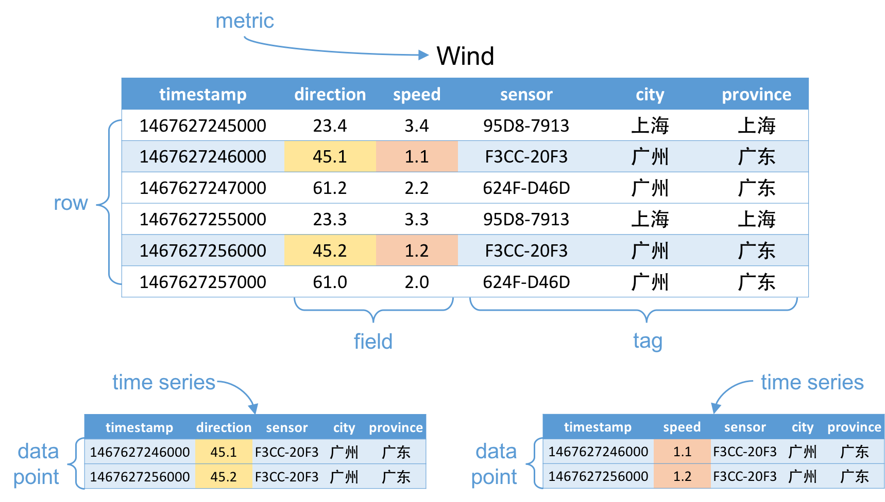
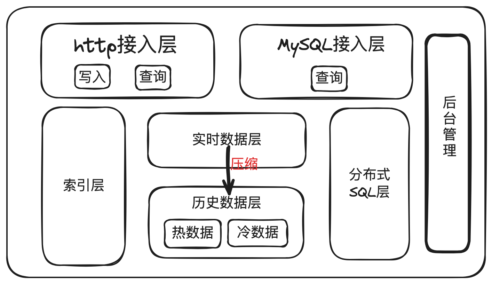
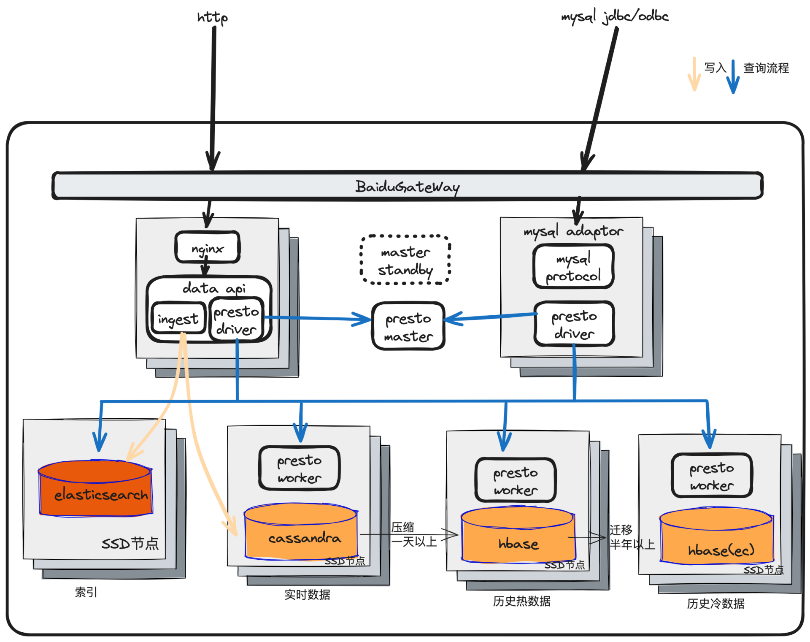

# 1. 引言
在当今数据驱动的世界中，时序数据库（TSDB）已成为处理和分析时间序列数据的关键工具。随着物联网（IoT）设备的激增和实时数据流的爆炸性增长，对高效处理和分析这些数据的需求日益迫切。聚合计算，作为TSDB的一个核心功能，为用户在海量时序数据中快速提取有价值信息提供了可能。

# 2. 名词解释
**TSDB**: Time Series Database，时序数据库，用于保存时间序列（按时间顺序变化）的海量数据。
**metric**: 度量，如发动机的温度、转速等。metric相当于关系型数据库中的table。
**timestamp**: 时间戳，格林威治时间1970年01月01日00时00分00秒(北京时间1970年01月01日08时00分00秒)起至现在的总毫秒数。
**field**: 度量下的不同字段，譬如位置这个度量下可以有经度和纬度两个字段。每个字段有相应的数值，如56°C、1000r/s等（实际中不带单位）。
**tag**: 标签，或附加属性，一个tag是一个key-value对，用于提供额外的信息，如“型号=ABC123”、“出厂编号=1234567890”等。
**row**: 数据行，“一个metric + m个field + n个tag + 一个timestamp”定义了一个数据行，一个row由m个data point组成。
**data point**: 数据点，“一个metric + 一个field + n个tag + 一个timestamp”唯一定义了一个数据点。
**time series**: 时间序列，“一个metric + 一个field + n个tag”唯一定义了一个时间序列，一个time series相当于一个设备上的一个传感器收集到的所有数据。
**group**: 分组，可以按tag对data point进行分组。
**aggregator**: 聚合函数，可以对一段时间的data point做聚合，如每10分钟的和值、平均值、最大值、最小值等。
**database**: 数据库，一个用户可以有多个database，一个database可以写入多个metric的data point。metric相当于table，timestamp + 所有tag相当于primary key。
metric、timestamp、field、tag、row、data point、time series的关系如下图所示：

# 3. 架构设计 
## 3.1总体架构设计

TSDB内部分为在线和离线两个部分。
在线部分主要是负责数据的实时读写，分为4层：
1. 接入层，又分为HTTP接入层和MySQL接入层，HTTP接入层负责提供对外的在线写入和查询接口，MySQL接入层提供基于MySQL的二进制协议的SQL查询接口，两者都提供认证鉴权和各种quota限制。
2. 索引层，负责根据metric和tag等字段对time series建立索引，实现time series的快速检索。
3. 分布式SQL层，负责将大数据量的SQL查询分拆成DAG（有向无环图）任务，在多个机器上并行完成，最后在接入层返回最终结果。
4. 数据层，又分为实时数据层和历史数据层，实时数据层负责存储最近写入的数据，当数据写入超过一天后，会进行压缩并写入历史数据层，最近半年为热数据，半年以上为冷数据，超过半年的热数据会自动迁移到冷数据存储。
   离线部分主要是负责后台管理，如database的创建删除、导入导出等。
## 3.2 在线部分架构

### 3.2.1 接入层
**BaiduGateWay**:  提供负载均衡的能力
**data api**: 为用户提供在线的数据写入和查询服务，
写入时，data api将索引写入elasticsearch，同时将数据写入cassandra；查询时，data api先从elasticsearch查询索引，然后将查询拆分成DAG任务，并通过presto master申请资源，再发送给presto worker，presto worker进行分布式并行计算，得到最终的查询结果。
data api提供短连接的Restful API给用户调用。
**mysql adaptor**: 为用户提供mysql二进制协议的长连接接入，从而使用户可以通过mysql jdbc/odbc driver连接TSDB并进行SQL查询。查询路径与data api类似。
### 3.2.2 索引层
**elasticsearch**
我们对时序数据的metric、field、tag建立索引，从而保证这些字段能被快速的检索，同时还能支持地理位置的检索。
elasticsearch用于存储这些索引，data api在写入数据的同时，需要将索引写入elasticsearch；在查询数据之前，需要先从elasticsearch查询索引。
快速了解elasticsearch：https://www.elastic.co/guide/en/elasticsearch/reference/current/documents-indices.html
### 3.2.3 分布式SQL层
**presto master**: 负责presto worker的发现，管理presto worker的资源，对任务进行调度，防止presto worker过载。
presto master是一个单点服务，但有一个standby做HA，primary挂掉之后，standby会成为新的primary，并从presto worker获取并恢复目前的资源分配状态，因此primary和standby之间不需要做状态同步。
**presto driver**: 是集成在data api和mysql adaptor中的模块，负责对SQL进行解析、优化、DAG生成，然后调用presto master进行资源的分配，最后调用presto worker进行分布式并行计算。
**presto worker**: 负责真正的计算任务的执行，由于执行任务是DAG的形式，所以presto worker之间存在互相访问。
为了减少网络开销，可以将presto worker和cassandra/hbase部署在同一个机器上，presto master在分配presto worker时首先考虑数据的本地化。
### 3.2.3 数据层
**cassandra**
最近写入的数据会首先写入cassandra，cassandra中存储的是最近1天写入的数据，主要是利用cassandra吞吐量大、延迟低、高可用的特性。
快速了解cassandra：什么是Cassandra？
**hbase**
数据写入cassandra一天之后，会从cassandra读出并进行压缩，再写入ssd机器上的hbase。这里使用hbase是利用hbase可运维性好的特性。
在ssd集群的hbase里超过半年的数据，会被迁移到sata集群的hbase，并进行ec编码，使副本数从3下降到1.5，同时sata的成本也比ssd低一个数量级，从而大大降低了历史数据的存储成本。
快速了解hbase：我终于看懂了HBase，太不容易了...
## 3.3 离线部分架构
主要是涉及后台管理相关，跳过不谈
