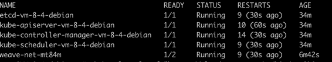

接下来，我们将按照书中的步骤，我们直接采用4.2小节`从0到1：搭建一个完成的Kubernetes集群`
1. 安装docker<br>
我们已经提前安装好docker了，跳过docker<br>
2. 安装kubeadm<br>
```shell
sudo apt-get update
sudo apt-get install -y apt-transport-https
curl -fsSL https://packages.cloud.google.com/apt/doc/apt-key.gpg | sudo gpg --dearmor -o /etc/apt/keyrings/kubernetes-archive-keyring.gpg
echo "deb [signed-by=/etc/apt/keyrings/kubernetes-archive-keyring.gpg] https://apt.kubernetes.io/ kubernetes-xenial main" | sudo tee /etc/apt/sources.list.d/kubernetes.list
sudo apt-get update
sudo apt-get install -y kubelet kubeadm kubectl
sudo apt-mark hold kubelet kubeadm kubectl # 关闭这三个程序的自动更新
```
当然在这个过程中，可能会碰到问题，eg:无法连接packages.cloud.google.com<br>
第三步:我们可能download不下来，参考这个👉[issue](https://github.com/kubernetes/k8s.io/pull/4837#issuecomment-1446426585)<br>
但是当时似乎这个方式也没有生效 我将其替换成了 `https://mirrors.aliyun.com/kubernetes/apt/doc/apt-key.gpg`
第四步:将https://apt.kubernetes.io/ 替换成 `https://mirrors.aliyun.com/kubernetes/apt/` 或者其他源
3. 接下来编写kubeadm.yaml文件<br>
结合书中的内容，然后做了一点修改，可以直接使用🤔
```shell
apiVersion: kubeadm.k8s.io/v1beta3
kind: InitConfiguration
nodeRegistration:
  kubeletExtraArgs:
    cgroup-driver: "systemd"
---
apiVersion: kubeadm.k8s.io/v1beta3
kind: ClusterConfiguration
kubernetesVersion: "v1.28.2"
imageRepository: registry.aliyuncs.com/google_containers
clusterName: "example-cluster"
controllerManager:
  extraArgs:
    horizontal-pod-autoscaler-sync-period: "10s"
    node-monitor-grace-period: "10s"
apiServer:
  extraArgs:
    runtime-config: "api/all=true"
```
4. 执行init<br>
```shell
kubeadm init --config kubeadm.yaml
```
init的过程中可能会碰到如下的问题：
```shell
[kubelet-check] Initial timeout of 40s passed.

Unfortunately, an error has occurred:
        timed out waiting for the condition

This error is likely caused by:
        - The kubelet is not running
        - The kubelet is unhealthy due to a misconfiguration of the node in some way (required cgroups disabled)
```
解决思路：<br>
* 把报错信息拿到往上搜索🔍，果然不出所料，没有什么进展。
* 翻阅kubeadm的issue，查看到相关的问题[问题](https://github.com/kubernetes/kubeadm/issues/2851#issuecomment-1535770518),按照他的解决办法成功解决这个问题。
5. 初次使用kubernetes，需要执行如下命令
```shell
mkdir -p $HOME/.kube
sudo cp -i /etc/kubernetes/admin.conf $HOME/.kube/config
sudo chown $(id -u):$(id -g) $HOME/.kube/config
```
6. 尝试使用kubectl describe node master
`The connection to the server 10.0.8.4:6443 was refused - did you specify the right host or port?` 又出问题了！！<br>
参考这个解决办法👉[解决办法](https://stackoverflow.com/questions/56737867/the-connection-to-the-server-x-x-x-6443-was-refused-did-you-specify-the-right)
7. 部署网络插件 
`kubectl apply -f "https://cloud.weave.works/k8s/net?k8s-version=$(kubectl version | base64 | tr -d '\n')`<br>
很不幸，这一步又报错了`Unable to connect to the server: dial tcp: lookup cloud.weave.works on 183.60.83.19:53: no such host`<br>
参考这个解决办法👉`kubectl apply -f https://github.com/weaveworks/weave/releases/download/v2.8.1/weave-daemonset-k8s-1.11.yaml`
8. 最后我们再查看我们的pod情况 kubectl get pods -n kube-system

撒花🎉 完结
